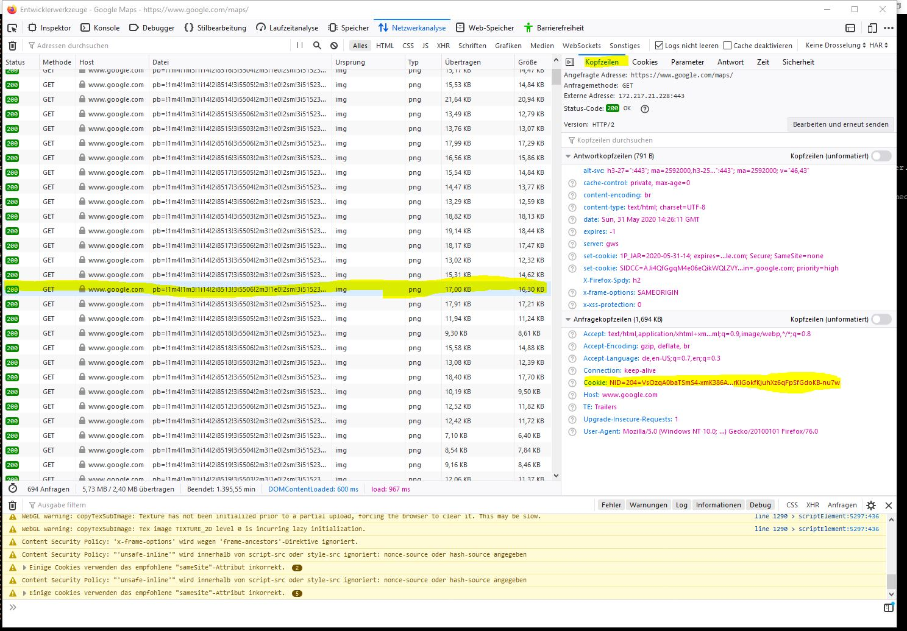

ioBroker adapter for google-sharedlocations
=================

## Description
This is an ioBroker-adapter that can retrieve the location data of users that are sharing their location via google shared
 locations. It can not retrieve the location of the user that is used to access google. 

Circularly shaped geofences can be defined in the adapter config. These geofences can be associated with users, i.e. 
that a state is toogled if the user enters or leaves a geofence.

The adapter can receive and process a bunch of messages, please have a look at main.js for details. 

## Usage
Currently login via the adapter is not possible. In future versions the adapter might create a proxy server and you'll have to
login via the browser once, similar to the alexa2 adapter. But currently you'll have to enter the cookie in the configuration page
manually in order to login. For this, do the following:
1. Log out of your google account
2. Log in to google.com/maps (.com is important!) with the account used for ioBroker
3. Open Developer Tools of your browser (ctrl+shift+I)
4. Navigate to network analysis
5. select any successful (Status = 200) GET (method) Request from google.com (Host column) (if the window is empty, hit F5 in the browser)
6. In the headers window copy all contents (ctrl+a then ctrl+c) from the line Cookie.

## Troubleshooting
### instance indicator is green t no location data is received or instance indicator is yellow and the log says "please login manually" 
In this case check the google account of the user that is used by the google-sharedlocations adapter. Log in with a 
browser and check if google blocked some logins. Click on a blocked login and confirm to google that this was you.
 Additionally check that two factor authentification is turned off.

If you still experience problems please open an issue. Please set the adapter level to debug and publish the log there. Otherwise I have no change to help.

## Donation
If this project helped you to reduce developing time, you can give me a cup of coffee or a bottle of beer via PayPal(chvorholt@gmail.com) :-)  

## Changelog
### 2.0.1 (03-Jun-2020)
- enforced min_polling_interval (Garfonso)
- improved error logging (Garfonso) 

### 2.0.0 (01-Jun-2020)
- fixed warnings from wrong object fields (Garfonso)
- removed authentication and allowed user to copy in cookie (Garfonso)

#### 1.5.4 (14-Apr-2019)
- user groups are no longer created

#### 1.5.3 (13-Apr-2019)
- updated npm package dependencies
- integrated adapter core from Apollon

#### 1.5.2 (19-Sep-2018)
- fence was not updated correctly

#### 1.5.1 (17-Sep-2018)
- changed location of trigger poll state 
- states are now members of named groups.

#### 1.5.0 (16-Sep-2018)
- added GPS position accuracy
- adapter should be more robust against datagram changes

#### 1.4.1 (16-Sep-2018)
- fixed places adapter support
- fixed translation issue with polling

#### 1.4.0 (16-Sep-2018)
- fences id can be determined by the user
- fences are properly added and removed now

#### 1.3.0 (14-Sep-2018)
- locations poll can be triggered by a state or by sending a message ("triggerPoll") to the adapter

#### 1.2.0 (13-Sep-2018)
- added state showing battery level and timestamp (solves #11)

#### 1.1.4 (13-Sep-2018)
- fixed roles

#### 1.1.3 (1-Sep-2018)
- Fixed installation problem

#### 1.1.2 (15-Aug-2018)
- Preparations for publishing the adapter

#### 1.1.1 (11-Aug-2018)
- Users can be simply selected in the admin config, i.e. userid need not to be entered manually

#### 1.1.0 (06-Aug-2018)
- Current address of the users is stored in a state 

#### 1.0.1 (05-Aug-2018)
- Code cleanup
- Moved authentification to its own module

#### 1.0.0 (17-Jul-2018)
- Added support for Admin3.

#### 0.0.7 (15-Jul-2018)
- Google makes it hard to mimic a user login. Improved login procedure.
- Minimum polling interval must be greater than 30s.

#### 0.0.6 (22-Apr-2018)
- Added support for [ioBroker.places adapter](https://github.com/BasGo/ioBroker.places)

#### 0.0.5 (20-Apr-2018)
- Fixed error that occurs when no fences exist

#### 0.0.4 (24-Feb-2018)
- Adapter does no longer crash if location data of a user has not been updated for a long time

#### 0.0.3 (13-Feb-2018)
- google had changed something in their authentification routine that made some changes necessary
- several bugfixes

#### 0.0.2 (02-Jan-2018)
- improved descriptions
- several bugfixes

#### 0.0.1 (31-Dec-2017)
- basic features tested

## Known issues
- objects for fences have to be deleted manually when they are removed in the admin interface

## Disclaimer
I am not in any association with Google.

## License
The MIT License (MIT)

Copyright (c) 2017-2019 Christian Vorholt <chvorholt@gmail.com>

Permission is hereby granted, free of charge, to any person obtaining a copy
of this software and associated documentation files (the "Software"), to deal
in the Software without restriction, including without limitation the rights
to use, copy, modify, merge, publish, distribute, sublicense, and/or sell
copies of the Software, and to permit persons to whom the Software is
furnished to do so, subject to the following conditions:

The above copyright notice and this permission notice shall be included in
all copies or substantial portions of the Software.

THE SOFTWARE IS PROVIDED "AS IS", WITHOUT WARRANTY OF ANY KIND, EXPRESS OR
IMPLIED, INCLUDING BUT NOT LIMITED TO THE WARRANTIES OF MERCHANTABILITY,
FITNESS FOR A PARTICULAR PURPOSE AND NONINFRINGEMENT. IN NO EVENT SHALL THE
AUTHORS OR COPYRIGHT HOLDERS BE LIABLE FOR ANY CLAIM, DAMAGES OR OTHER
LIABILITY, WHETHER IN AN ACTION OF CONTRACT, TORT OR OTHERWISE, ARISING FROM,
OUT OF OR IN CONNECTION WITH THE SOFTWARE OR THE USE OR OTHER DEALINGS IN
THE SOFTWARE.
